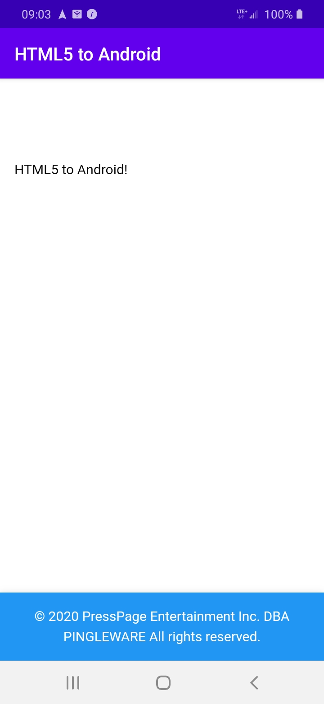

# html5-to-android
A shell Android Studio project for creating native Android apps from HTML5 files

## Background and Purpose
Back in 2014, when the Intel XDK was available for building cross platform mobile applications, my Android development commenced. During the release status of the Intel XDK, builds would break, the intention to provide a template for Android Studio. In 2016, Intel stop supporting and disabled the build process. I moved to Cordova with the intention of keep using the existing source code, hence reuse! Recently, Google Play Store is complaining about unused code and size optimization issues. Since I already developed a template for Webview android development, I needed to update to ensure the template is working with the latest version (4.0.1) of Android Studio. My Android development resumes!

# See the Tutorial
Tutorial: How to Safely Implement Hybrid HTML5 Android Applications
https://www.codementor.io/android/tutorial/secure-hybrid-html5-android-webview-mobile-app

# Implementing your HTML5 files
Replace the files under assets/www with your html5 web root files.

# Replace the launcher icon
1. Resize your icon to 96x96,
2. Fron Android Studio, choose File > New image asset
3. Browser to the icon. Click next
4. Confirm the next dialogs, which will replace the current default launcher icon with your new icon as well as create additional sizes.
5. Debug on your USB Android device, then exit the application and check the icon change.

# Creating a Signed APK
See http://www.techotopia.com/index.php/Generating_a_Signed_Release_APK_File_in_Android_Studio

## KEYSTORE with Private Key
The keystore with the private key are included. DO NOT USE FOR PRODUCTION!

Password for the keystore and alias: password

# Additional tips for creating webview application
http://developer.android.com/guide/webapps/webview.html

# Screenshot

